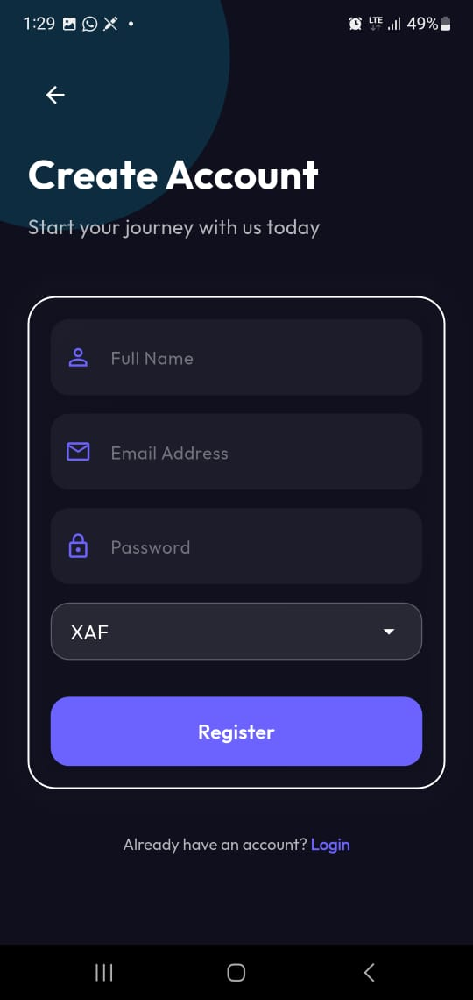
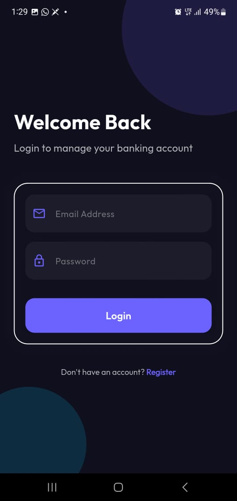

# Afric - Premium Banking Experience

## [By Marvelous Ahaiwe](https://github.com/Marvelousahaiwe)

Afric is a modern, high-performance banking
application built with Flutter, designed to offer a
seamless and secure financial management experience.
The app features a stunning glassmorphism UI,
real-time data synchronization, and robust security protocols.

## ✨ Key Features

### 🚀 Seamless Onboarding

- **Instant Registration**:
  Simple and intuitive signup process with currency
  selection.

- **Auto-Login**:
  New users are automatically authenticated and
  directed to the Dashboard immediately after
  successful registration.

- **Visual Feedback**:
  Real-time success notifications (SnackBars) for key
  authentication events.

### 💳 Dynamic Dashboard

- **Glassmorphism Design**:
  A premium visual experience with smooth gradients and
  interactive elements.

- **Real-time Balance**:
  Managed through a `forceRefresh` mechanism that
  bypasses cache after transactions to ensure 100%
  accuracy.

- **Session-based Transactions**:
  Detailed logs of active session transactions with
  "Before" and "After" balance snapshots.

- **Quick Actions**:
  Easy-to-use Credit and Debit dialogs for immediate
  account management.

### 🛡️ Advanced Security

- **Inactivity Timeout**:
  Automatic logout after 5 minutes of inactivity to
  protect sensitive data.

- **Deep Purge**:
  Logout and timeout events trigger a complete reset of
  in-memory states and secure storage.

- **Secure Persistence**:
  Passwords and tokens are never stored in plain text;
  all sensitive data uses `flutter_secure_storage`.
  ## App Download
- Click to download app [Download](https://i.diawi.com/5tnjBP)

## Screenshots

<p float="left">  
   
  
   
</p>

## 🏗️ Architecture

The project follows **Clean Architecture** principles
to ensure maintainability, testability, and
scalability:

- **Presentation Layer**: Uses the **BLoC (Business Logic Component)** pattern for
  predictable state management.
- **Data Layer**: Implements the Repository pattern, separating remote API calls from
  local storage logic.
- **Core Layer**: Contains global design tokens, shared widgets, and cross-cutting
  concerns like network configuration and DI.

## 🛠️ Technology Stack

- **Flutter**: UI Framework.
- **Bloc/Flutter Bloc**: State management.
- **Dio**: Powerful HTTP client for API interactions.
- **Flutter Secure Storage**: Encrypted local storage.
- **Injectable & Get-It**: Automated Dependency Injection.
- **Intl**: Currency and date formatting.
- **Animate Do**: Smooth UI animations.

## 🚀 Getting Started

### Prerequisites

- Flutter SDK (Latest Stable)
- Android Studio / VS Code
- Dart SDK

### Installation

1. **Clone the repository**:

   ```bash
   git clone https://github.com/Marvelousahaiwe/afric_technical_assessment
   cd afric
   ```

2. **Install dependencies**:

   ```bash
   flutter pub get
   ```

3. **Run code generation** (for DI and JSON
   serialization):

   ```bash
   flutter pub run build_runner build
   --delete-conflicting-outputs
   ```

4. **Launch the application**:
   ```bash
   flutter run
   ```
